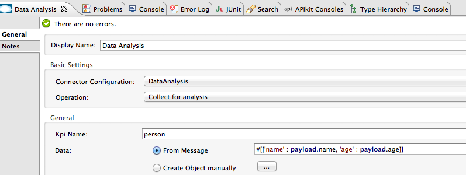

= Data Analysis Connector

A connector which provides FIFO queues which internally uses the Mule Object Store to store the data. Hence, if the object store is persistent and the application is interrupted, the data will reappear on the queue once it is restarted.

---

== Contents:

. Introduction
.. How does it work?
.. Prerequisites
.. Requirements
.. Dependencies

. Installing & Configuring
.. Installing
.. Configuring

. Using the Statistics Collector
.. Configuring
.. Running

. Using the Data Analysis Connector

. Case Study: Diving Company

. See Also

---

== Introduction 

In today’s world, business is not just about selling a product. It is much more complicated than that. Analysing the market to be able to target your products to the right consumers will give you a much better result than just “shooting in the dark”. Marketing needs to be focused so that you don’t spend money on advertising to irrelevant audiences.

This is what Ricston Analytics Tool (RAT) is all about. It’s a tool to help you analyse your data in your IT systems to be able to use it to your advantage. In real-time! It can also help the operations team to monitor your IT systems.

*What are the advantages of RAT?*

* It’s based on open source and is easy to implement
* It presents data visually and instantly
* It serves the needs of operations, marketing and IT teams

=== How does it work?

RAT is based on 4 components:

* Elastic Search
* Log Stash
* Kibana
* Statistics Collector

The first three components are off the shelf open source products.

Elastic Search is a fast no-SQL database based on the Lucene indexing engine. Connections to Elastic Search are made through a REST interface using JSON rather than through a database driver. It supports clustering and sharing.

Log Stash is a tool to monitor logs. It can monitor log files, parse and then store them in a different location for analysis. Log Stash can be very easily connected to Elastic Search to store the parsed logs.

Kibana is the visual component. It can be very easily configured to connect with Elastic Search, pull the data from it and represent it in graphs and charts. Creating dashboards in Kibana is very easy, and each of the dashboards look great.

The Statistics Collector is a bespoke product built by Ricston to collect statistics from any Java VM through JMX. The collected information is stored in Elastic Search for later analysis. Out of the box it comes with all the default JVM configuration. It collects information such as garbage collection, memory pools, CPU usage… RAT also provides pre-configured dashboards that can visualise this information, and it all happens in real-time.

While this information might be useless for the business analysis, it is extremely useful to the operations team.

Another very strong feature for the operations team is the log analysis feature. With the use of Log Stash, logs can be collected, parsed and stored in Elastic Search. With Kibana, we can visualise, and query for particular logs. RAT provides out of the box configuration files for Mule for Log Stash, and a dashboard for Kibana.

However this is not the strongest point of RAT. As we said in our introduction, the aim of RAT is to help you analyse your business data to support your business decisions. The way we deal with the data collection is different for each product. In this blog post, we show you how we perform data collection for Mule ESB. This works for both Mule CE and Mule EE.

Assuming that you know what Mule is and how it works, we can now introduce you to the fifth component of RAT. A custom Mule connector called Data Analysis Connector, used to collect selected data from your Mule flows. Let’s start with an example.

For more information on RAT's architecture, please read on https://github.com/Ricston/ricston-analytics-tool/wiki/Architectural-Overview[here].

=== Prerequisites

This document assumes that you are familiar with Mule, http://www.mulesoft.org/documentation/display/35X/Anypoint+Connectors[Anypoint™ Connectors], and the http://www.mulesoft.org/documentation/display/35X/Anypoint+Studio+Essentials[Anypoint™ Studio interface]. To increase your familiarity with Studio, consider completing one or more http://www.mulesoft.org/documentation/display/35X/Basic+Studio+Tutorial[Anypoint™ Studio Tutorials]. Further, this page assumes that you have a basic understanding of http://www.mulesoft.org/documentation/display/current/Mule+Concepts[Mule flows] and http://www.mulesoft.org/documentation/display/current/Global+Elements[Mule Global Elements]. 

=== Requirements

* http://www.mulesoft.org/documentation/display/current/Hardware+and+Software+Requirements[Hardware and Software Requirements]

=== Dependencies

Supported Mule Runtime Versions: 3.6.x

---

== Installing and Configuring 

=== Installing

* *Elastic Search*
+
To install Elastic Search, follow the guide https://github.com/Ricston/ricston-analytics-tool/wiki/Installation-Guide-%7C-Elastic-Search[here].

* *Kibana*
+
To install Kibana, follow this guide https://github.com/Ricston/ricston-analytics-tool/wiki/Installation-Guide-%7C-Kibana[here].

* *Logstash*
+
To install Logstach, follow the guide https://github.com/Ricston/ricston-analytics-tool/wiki/Installation-Guide-%7C-Logstash[here].

* *Data Analysis Connector*
+
You can "test drive" the Data Analysis connector by installing it on Anypoint™ Studio. Follow the instructions to http://www.mulesoft.org/documentation/display/current/Download+and+Launch+Anypoint+Studio[download and launch Anypoint™ Studio], then follow the steps below to install the connector.
+
To install the Data Analysis connector in Anypoint Studio:

. Under the *Help* menu in Anypoint™ Studio, select *Install New Software*.
+
image::images/install01.png[]
. On the *Install* wizard, click the drop-down arrow for the *Work with:* field, then select the Anypoint™ Connector update site.
+

. In the table below the *Filter* field, click to expand the *Community* folder, and click the check box for *Data Analysis Connector (Mule 3.5.0+)*. Click *Next*.
+

. In Install Details, click *Next*.
. In Review Licenses, review the license text, and click *I accept the terms of the license agreement*. Click *Finish*. The connector installs.
. At the end of the installation, click *Yes* to restart Anypoint Studio. After Anypoint Studio restarts, the Data Analysis connector appears in the list of connectors.

=== Configuring

To use the Data Analysis connector, you must configure:

* A global Data Analysis element for use by all the Data Analysis connectors in an application.
- _Anypoint™ Studio Visual Editor_
. Click the *Global Elements* tab at the base of the canvas, then click *Create*.
. In the *Choose Global Type* menu, use the filter to locate and select *Data Analysis*, then click *OK*.
. Configure the parameters according to the table below.
+
|===
|Parameter 						|Description

|*Name*							|Enter a name for the configuration so it can be referenced later.
|===
+

- _Anypoint™ Studio XML Editor_
+
Create a global Data Analysis configuration outside and above your flows, using the following global configuration code. Ensure that you include the Data Analysis namespaces in your configuration file.
+
[source,xml]
----
<mule xmlns:dataanalysis="http://www.mulesoft.org/schema/mule/dataanalysis"
	xmlns="http://www.mulesoft.org/schema/mule/core"
	xmlns:doc="http://www.mulesoft.org/schema/mule/documentation"
	xmlns:spring="http://www.springframework.org/schema/beans" version="EE-3.6.2"
	xmlns:xsi="http://www.w3.org/2001/XMLSchema-instance"
	xsi:schemaLocation="http://www.springframework.org/schema/beans http://www.springframework.org/schema/beans/spring-beans-current.xsd
http://www.mulesoft.org/schema/mule/core http://www.mulesoft.org/schema/mule/core/current/mule.xsd
http://www.mulesoft.org/schema/mule/dataanalysis http://www.mulesoft.org/schema/mule/dataanalysis/current/mule-dataanalysis.xsd">
    <dataanalysis:config name="DataAnalysis" doc:name="DataAnalysis"/>
</mule>

----

* Parameters of each Data Analysis connector instance in the application flows.
. Drag the Data Analysis connector onto the canvas, and double-click it to open the Properties Editor console.
. Configure these parameters for the connector:
+
|===
|Field						|Description

|*Display Name*				|Enter a unique label for the connector in your application.
|*Connector Configuration*	|Connect to a global element linked to this connector. Global elements encapsulate reusable data about the connection to the target resource or service. Select the global Data Analysis connector element that you just created.
|*Operation*				|Select the action this component must perform.
|===
+
NOTE: Refer to the list of supported operations and their descriptions in the ApiDoc http://mulesoft.github.com/ricston-analytics-tool/[here].
 
---

== Using the Statistics Collector
Statistic Collector Service is available as a zip file. Installing is very simple, unzip into your preferred directory.

=== Configuring
Before running the statistics collector, the configuration file found in _${STATISTICS_COLLECTOR_HOME}/conf/collector.properties_ needs to be amended to match your environment. There are only a couple of properties shown below which needs to be configured, mainly include the JMX host, port and path, the Elastic Search host and port, and the cron expression that determine at what time/how often the collector collects the data.

 cron=0/1 * * * * ?
 jmx.host=localhost
 jmx.port=1099
 jmx.path=server
 elasticsearch.host=localhost
 elasticsearch.port=9200

=== Running
Statistics collector can be run either as a normal process in the foreground, or it can be installed as a service on a windows machine, or run as a daemon on a linux machine. Running should be done in the following way:

 ./bin/statistics-collector <mode>

Simply executing _./bin/statistics-collector_ will print on the screen the possible modes.

 ./bin/statistics-collector

 uname: illegal option -- o
 usage: uname [-amnprsv]
 Usage: ./bin/statistics-collector [ console | start | stop | restart | condrestart | status | install | remove | dump ]

 Commands:
   console      Launch in the current console.
   start        Start in the background as a daemon process.
   stop         Stop if running as a daemon or in another console.
   restart      Stop if running and then start.
   condrestart  Restart only if already running.
   status       Query the current status.
   install      Install to start automatically when system boots.
   remove       Uninstall.
   dump         Request a Java thread dump if running.

== Using the Data Analysis Connector

The connector is very easy to use. When the developer needs to collect some data, he should drop the Data Analysis message processor and use Mule expressions to extract data from the payload, or supply the whole payload (see image below). The data returned by the message processor should be nothing more than a Map, with key value pairs of the data the developer needs to collect. This data will be stored temporarily on the Mule machine asynchronously, until the statistics collector agent retrieves it. Data is retrieve in the same way other data is collected, through JMX.

 <flow name="UnsecureServiceFlow" doc:name="UnsecureServiceFlow">
    <http:inbound-endpoint host="localhost" port="${service.port}" path="register/unsecure" doc:name="HTTP" exchange-pattern="request-response"/>
    <cxf:jaxws-service serviceClass="com.ricston.component.IRegistration" doc:name="CXF" />
    <dataanalysis:collect-for-analysis config-ref="DataAnalysis" doc:name="DataAnalysis" kpiName="person" >
        <dataanalysis:data ref="#[['name' : payload.name, 'age' : payload.age]]"/>
    </dataanalysis:collect-for-analysis>
    <component class="com.ricston.component.Registration" doc:name="Java"/>
 </flow>

== Case Study: Diving Company

Lets say we form part of a diving company that provides a web service implemented within Mule that accepts applications for diving courses. The business wants to analyse what is the most popular age range so it can better target its advertising.

The Data Analysis Connector can be used to extract the age out of the Mule payloads and save it for analysis. For example, this is how our web-service flow would look:

 <flow name="DivingApplicationFlow" doc:name="DivingApplicationFlow ">
     <http:inbound-endpoint host="localhost" port="${service.port}" path="register" doc:name="HTTP" exchange-pattern="request-response"/>
     <cxf:jaxws-service serviceClass="com.ricston.diving.IRegistration" doc:name="CXF" />
     <dataanalysis:collect-for-analysis config-ref="DataAnalysis" doc:name="DataAnalysis Age" kpiName="age" >
         <dataanalysis:data ref="#[['age' : payload.age]]"/>
     </dataanalysis:collect-for-analysis>
     <component class="com.ricston.driving.Registration" doc:name="Java"/>
 </flow>

_P.S. This connector does not blindly collect all your data unless you explicitly tell it to do so. We leave it in your hands to decide what data to collect in case you have sensitive information in there._

There are two things you need to configure here; a KPI name (key performance indicator) so you can easily search for it through Kibana (especially you have lots of KPIs) and the actual data itself. The actual data is nothing more than a simple map. In this case we are building a map with a single key value pair, key is the ‘age’ string, value is the age of the customer that is applying for the diving course.

This information will first be stored locally in a temporary location, until the Statistics Collector retrieves it and pushes it to Elastic Search. RAT provides an out of the box dashboard for you to easily analyse this information, as below. In this dashboard, we can see the number of applications for the diving course against time:

This is all very interesting. But what if now the business wants to check the number of applications received from 18 year olds? Kibana allows you to run queries against your data, so to show this result to your business owner, just use the query ‘age:18’ as shown below:

What if now your business owner asks you the big question: ‘Can you please compare for me the number of applications by people aged between 0 to 18, with people aged between 50 to 100?’ In Kibana, using the out of the box dashboard provided with RAT, it is very easy. Just create two queries, ‘age:[0 TO 18]’ and another one ‘age:[50 TO 100]’. As you can see below, you business owner will get this information immediately:

Also remember that all this information is almost in real-time!

To sum up, RAT is a tool based on open source products that help you analyse your data. It can be used both by an operations team to monitor the state of the JVM, and by the business team to analyse the market.

If you want to know more about RAT or get the Tech specs, just drop us a line – we’ll be happy to help.

---

=== See Also

 * Access full reference documentation for the connector https://github.com/Ricston/ricston-analytics-tool/wiki[here].
